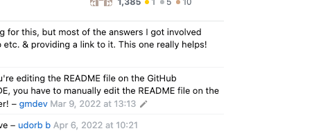

# Stackoverflow-Light

## Overview

This project represents the backend side of a 'Forum' application, where the users can ask and respond to questions.

### Most important functionalities:

<ol>
 <li>Users can see questions but are not allowed to post anything unless they log in.</li>
 <li>The users are authenticating against Keycloak as OIDC provider (also supporting Registration).</li>
<li>The questions are displayed based on popularity (i.e. total number of UNIQUE viewers).</li>
<li>Questions are not retrieved all at once. Being a heavy read application, the questions will be fetched and buffered as the end-user is 'scrooling'.</li>
<li>For question retrieval the application is making use of caching.</li>
<li>The application is fully containerized and delivery ready, providing a 'prepopulated db' and a 'preconfigured keycloak' server (check Running steps section)</li>

</ol>

## Tech stack used:
<ol>
 <li>C#/.NET Asp -> REST API Implementation  </li>
<li>Keycloak -> OIDC provider</li>
<li>MySql -> Database </li>
<li>Docker + docker compose -> Containerization </li>
</ol>

## Oidc user mapping

The Rest API is relying on an external Identity Provider. This means that the users are being registered and authenticated against an external server (which is also storing their credentials).   However this comes with a significant challenge, as the API should also be able to interact with a 'local representation' of the users in order to be able to make certain decisions (i.e. Should the user be allowed to delete this question? Which user posted this question? etc.).
  To be able to achieve that, the REST application is defining a special endpoint **/user/create-mapping** that decodes the access token received under the Authorization header and extracts the username ("preffered_name" claim) + the user's id in the OIDC provider ("sub" claim). Using those claims the Api will create a mapping between the OIDC user and it's representation in the relational db.

### Scenarious covered:
<ol>
 <li>Multiple 'create mapping requests' with the same token might come </li>
<li>Keycloak -> OIDC provider</li>
<li>MySql -> Database </li>
<li>Docker + docker compose -> Containerization </li>
</ol>
![Error Message] (./images/img.png)

## Testing

The Api is implementing a collection of Unit tests covering all workflows including exception handling. The tests can be found in *Stackoverflow-Light.Tests* directory.
  A future improvement will be the addition of Integration Tests using a tool like Postman (covering the token handling + requests).

## CI/CD Pipeline

The project is also defining a Continuous Integration/Continuous delivery pipeline, using Github Actions.
Every time a push is made on the **main** branch, the API's Unit tests will be triggered resulting in a successful build / a failure. The pipeline logic might be enchanced by pushng the artifcats to a remote repo (such as dockerHub) only on *green* builds.
  The pipeline definition can be found in *.github/workflows/dotnet-tests.yaml*.