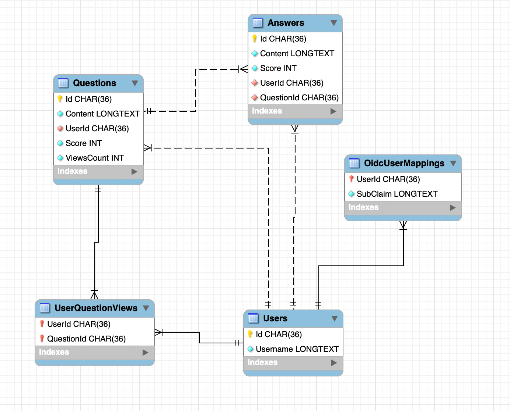

# Stackoverflow-Light

## Overview

This project represents the backend side of a 'Forum' application, where the users can ask and respond to questions.

### Most important functionalities:

<ol>
 <li>Users can see questions but are not allowed to post anything unless they log in.</li>
 <li>The users are authenticating using Keycloak as OIDC provider (also supporting Registration).</li>
<li>The questions are displayed based on popularity (i.e. total number of UNIQUE viewers).</li>
<li>Questions are not retrieved all at once. Being a heavy read application, the questions will be fetched and buffered as the end-user is 'scrolling'.</li>
<li>For question retrieval the application is making use of caching.</li>
<li>The application is fully containerized and delivery ready, providing a 'prepopulated db' and a 'preconfigured keycloak' server (check Running steps section)</li>

</ol>

## Tech stack used:
<ol>
 <li>C#/.NET Asp -> REST API Implementation  </li>
<li>Keycloak -> OIDC provider</li>
<li>MySql -> Database </li>
<li>Docker + docker compose -> Containerization </li>
</ol>

## Oidc user mapping

The Rest API is relying on an external Identity Provider. This means that the users are being registered and authenticated using an external server (which is also storing their credentials).   However this comes with a significant challenge, as the API should also be able to interact with a 'local representation' of the users, in order to be able to make certain decisions (i.e. Should the user be allowed to delete this question? Which user posted this question? etc.).
  To be able to achieve that, the REST application is defining a special endpoint **/user/create-mapping** that decodes the access token received under the Authorization header and extracts the username ("preferred_username" claim) + the user's id in the OIDC provider ("sub" claim). Using those claims the Api will create a mapping between the OIDC user and it's representation in the relational db.

### Scenarios covered:
<ol>
 <li>Multiple 'create mapping requests'  might come from the same user -> Fig 1 </li>
<li>A request might be done to an authorized endpoint prior to the mapping being created (in this case the fronted client should implement a redirect/ retry strategy) -> Fig 2</li>
</ol>

Fig 1:

Fig 2:

### Admin Users

The application is also supporting administrators. They are users with special privileges defined at OIDC provider level. 
  While regular users are allowed to delete/ modify only the questions + answers that they created, Admin users are allowed to delete any question or answer. This will guarantee a more controlled and safe environment.
  This is done by setting up a middleware that will decode the token and search for a special OIDC role:

## Questions Popularity Strategy

To identify the most popular questions, the API is implementing a logic to identify the number of **unique** viewers.  
This is done by creating a *many-to-many* SQL relationship between User and Question Entities. The associative table that stays in the middle will identify the userIds that already *clicked* on a specific question, to avoid counting them multiple times.
  As part of this strategy, an additional field was defined in the Question table (ViewCount) that is being incremented whenever a new user is clicking on a specific question. This will ensure fast ordering when retrieving the **most popular** questions first.

## Caching Strategy

The Api is implemented in a way so that when scrolling on questions page the user won't get all questions *at once*. Instead, a buffering strategy is implemented.   The endpoint that fetches the questions is expecting two additional query parameters : offset (current question index) + size(number of questions to retrieve on a single request).
  What is more, an in-memory caching strategy is applied (because the Api *expects* the user to scroll further). To reduce latency, on a *cache miss* the Api won't retrieve from the DB **only** the requested questions, but a bigger batch (controlled by the "DbBatchSize" value in **appsettings.json** -> by default set to 40). 
  On a new request, the Api will check if the questions requested are already present in the cache (by computing a cache key). 

## Database EER Diagram 

## Testing

The Api is implementing a collection of Unit tests covering all workflows including exception handling. The tests can be found in *Stackoverflow-Light.Tests* directory.
  A future improvement will be the addition of Integration Tests using a tool like Postman (covering the token handling + requests).

## CI/CD Pipeline

The project is also defining a Continuous Integration/Continuous Delivery pipeline, using Github Actions.
Every time a push is made on the **main** branch, the API's Unit tests will be triggered resulting in a successful build / a failure. The pipeline logic might be enhanced by pushing the artifacts to a remote repo (such as dockerHub) only on *green* builds.
  The pipeline definition can be found in *.github/workflows/dotnet-tests.yaml*.

## Running steps

The **only** prerequisite needed to run the project is to have docker + docker compose  installed on your machine.

1. Open the terminal on your machine.
2. Clone this repository. 

   <code>git clone https://github.com/radumocanu1/Stackoverflow-Light.git</code>
3. Navigate to project root.
    <code>cd Stackoverflow-Light</code>
3. Start the services (.Net API + Keycloak Server + Mysql Instance) using docker compose:
    <code>docker compose up -d</code>
4. Wait for the containers to start.
5. Navigate to swagger UI.
 <code>http://localhost:8080/swagger/index.html</code>

## Additional testing information 

1. Two users are already created: Regular user (username:user, password: user) + Admin User (username: admin, password:admin).
2. To authenticate click on the **Authorize** button in swagger (without providing any client secret as the clientID is set to public).

3. One can create multiple users by clicking on the User Registration option on Keycloak UI.

4. To change the current user click on this button. 

5. The db was already populated with some data (aprox 60 questions) to showcase the caching mechanism. However, the Ids are AI-generated, some of them not being interpreted as GUID type. For extensive testing please create own entries. 

## Future work:

 - Add a more comprehensive documentation to Swagger UI.
 - Include postman integration tests in the CI/CD pipeline using a tool like *newman*
 - Upvote/Downvote questions + answers